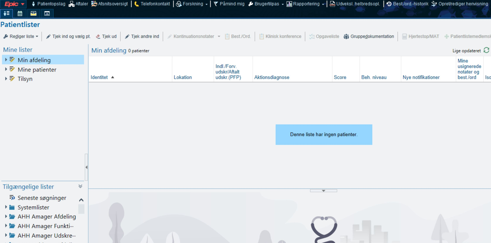
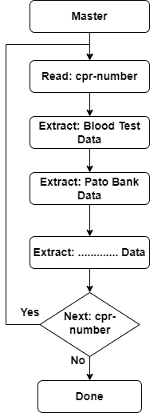

# AI project is being undertaken in collaboration with RUC and DTU
The project is focused on a particular group of patients, and its objective is to extract relevant data from the Epic software and store it in Excel files. 
It is important to note that the study has received all the necessary permissions from the Danish Board of Health to be conducted.

# Run the software on a new machine 
First, install Python on your system. Then, navigate to the master folder in the command line and run the command `Python -m pip install -r requirements.txt` to install all 
the necessary libraries listed in the `requirements.txt` file either globally or in a virtual environment. 

Once the libraries are installed, you can run the module using Python by executing the command `python open_extract_close_patient.py`

### To ensure that the software runs correctly, please follow these steps:

1. Create a cprs.xlsx file that contains all the CPR numbers that should be used to extract the data. 
   The cprs.xlsx file should have a column named "cpr" and look like the example below:

   


2. Ensure that the Epic program is open before running the python open_extract_close_patient.py module. 
   Navigate to the appropriate page as shown in the image below before running the module. 
   This will ensure that the module runs correctly and extracts the desired data.
   


# For new developers want to participate


### First: Develop a new module
The first step for developers is to create a new module by creating a folder that corresponds to the specific data they are trying to extract. 
It is important for them to ensure that their module contains a main function that can be called by the master to run their module.

### Second: Integrate the module to the master folder
The next step is to integrate their module into the master folder. The master folder contains a module named 'open_extract_close_patient.py' 
with a main function that clicks on an image in Epic software called 06-laboratoriesvar.jpg, waits for a specified amount of time to ensure data loading, 
and then calls the extract_blood_test_data_from_columns() function to begin creating an Excel file for the patient. Please look at the example below:

```
#################################################
click_by_mouse_on('06-laboratoriesvar.jpg')
# Delay the click for 5 second
time.sleep(5)

from blood_test.extract_data_from_columns \
    import extract_blood_test_data_from_columns
extract_blood_test_data_from_columns(cpr_nr)
# Delay the click for 2 second
time.sleep(2)
# End of extracting blood test data
#################################################
```

### Third:
When you are done with your module please make sure to have requirments.txt file that has all the necseesry library need to be installed in order to run your module

## Comment
It is essential for new developers to carefully follow these instructions to ensure that their modules are properly integrated into the project and that they contribute to the overall success of the project.

### Flowchart-Diagram



#### The following is a list of Python libraries used by the project:

- argcomplete: provides easy command line argument completion.
- beautifulsoup4: provides tools for web scraping and parsing HTML and XML documents.
- chardet: detects the encoding of a byte stream or file.
- compressed-rtf: decompresses RTF (Rich Text Format) files.
- docx2txt: extracts plain text from Microsoft Word (DOCX) files.
- ebcdic: provides tools for converting between EBCDIC and ASCII text.
- et-xmlfile: provides low-level support for working with XML files in Excel.
- extract-msg: extracts data and attachments from Outlook MSG files.
- html5lib: provides a pure Python HTML parser for web scraping and parsing HTML documents.
- IMAPClient: provides an easy-to-use client interface for IMAP (Internet Message Access Protocol) servers.
- keyboard: provides a cross-platform way to listen for keyboard events.
- lxml: provides high-performance tools for parsing XML and HTML documents.
- MouseInfo: provides tools for getting the current position and color of the mouse cursor.
- numpy: provides tools for working with arrays and numerical data.
- olefile: provides tools for working with OLE (Object Linking and Embedding) files.
- opencv-python: provides computer vision tools, including image processing and object detection.
- openpyxl: provides tools for working with Excel files in Python.
- packaging: provides tools for building and distributing Python packages.
- pandas: provides tools for working with structured data in Python.
- pdfminer.six: provides tools for extracting text and data from PDF files.
- Pillow: provides tools for working with images in Python.
- PyAutoGUI: provides tools for controlling the mouse and keyboard programmatically.
- pycryptodome: provides cryptographic tools and algorithms.
- PyGetWindow: provides tools for getting information about windows on the screen.
- PyMsgBox: provides tools for displaying message boxes and dialogs.
- pyperclip: provides tools for copying and pasting text to and from the clipboard.
- PyRect: provides tools for working with rectangles in Python.
- PyScreeze: provides tools for taking screenshots and finding images on the screen.
- pytesseract: provides tools for optical character recognition (OCR).
- python-dateutil: provides tools for working with dates and times in Python.
- python-pptx: provides tools for working with PowerPoint files in Python.
- pytweening: provides tools for tweening (interpolating) between values.
- pytz: provides tools for working with time zones in Python.
- pytz-deprecation-shim: provides a shim for deprecated pytz module behavior.
- pywin32: provides tools for working with Windows APIs and COM objects.
- six: provides Python 2 and 3 compatibility utilities.
- sortedcontainers: provides fast, pure-Python implementation of sorted collections.
- soupsieve: provides a CSS selector library for parsing HTML and XML documents.
- SpeechRecognition: provides tools for performing speech recognition.
- tesseract: provides tools for optical character recognition (OCR).
- textract: provides tools for extracting text from various file formats.
- tzdata: provides the IANA Time Zone database.
- tzlocal: provides tools for getting the local timezone in Python.
- webencodings: provides tools for working with HTML and XML character encodings.
- xlrd: provides tools for reading Excel files in Python.
- XlsxWriter: provides tools for writing Excel files in Python.


# Dependency Management

## The problem
Be aware of the cost and try to use the standard library as much as you can

[Malicious Python libraries targeting Linux servers removed from PyPI](https://www.zdnet.com/article/malicious-python-libraries-targeting-linux-servers-removed-from-pypi/)

[Our Software Dependency Problem](https://research.swtch.com/deps)

## Package managers
Specify which version of a package you want to install. It will save you from surprises in the future when someone accidentally introduces a bug or a change to a function parameters.

[Pipenv: Python Dev Workflow for Humans](https://pipenv.pypa.io/en/latest/)

## Virtualenvs
A python interpreter can work with only one version of a package at a time. If you work on two projects, one using pandas 0.22, and the other using pandas 0.25, this can be an issue.

